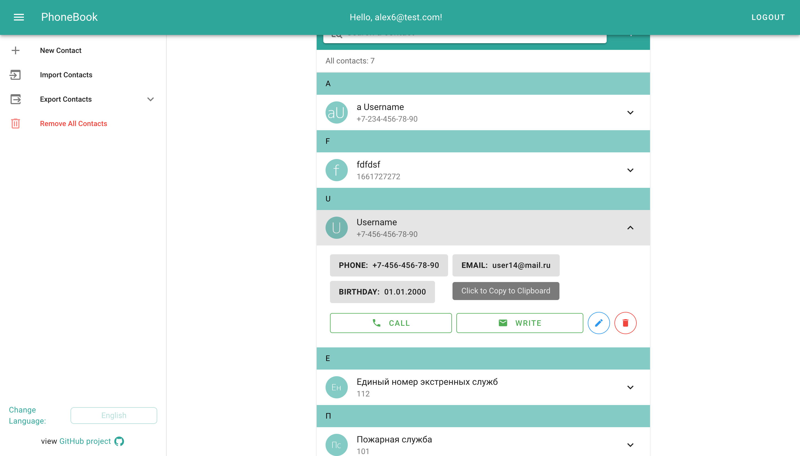

# phone-book


## Содержание

-   [1. Описание приложения](#1-описание)
    -   [1.1. Стэк](#11-стэк)
    -   [1.2. Референс](#12-референс)
-   [2. Интерфейс приложения](#2-интерфейс-приложения)
    -   [2.1. Страница Авторизации](#21-страница-авторизации)
    -   [2.2. Страница контактов](#22-страница-контактов)
    -   [2.3. Форма "Добавить"/"Редактировать"](#23-форма-добавитьредактировать)
-   [3. Установка зависимостей и запуск проекта](#3-установка-зависимостей-и-запуск-проекта)
    -   [3.1. Установка зависимостей](#31-установка-зависимостей)
    -   [3.2. Запуск в режиме разработки](#32-запуск-в-режиме-разработки)
    -   [3.3. Сборка для прода](#33-сборка-для-прода)
-   [4. Замечания](#4-замечания)

---

## 1. Описание приложения

-   Данный проект был выполнен для получения практики работы с библиотекой компонентов **Vuetify**
-   Приложение представляет собой телефонную книгу с информацией о контактах (имя, номер телефона, электронная почта, дата рождения)
-   В приложении реализована авторизация и сохранение данных на сервере Firebase, благодаря чему любой пользователь может получить доступ к своему конкретному списку контактов с любого устройства

### 1.1. Стэк

-   Vue 3, VueX, Vue Router
-   [Vuetify 3](https://github.com/vuetifyjs/vuetify)
-   [Axios](https://github.com/axios/axios)
-   [Vue-i18n](https://github.com/intlify/vue-i18n-next) (Локализация приложения)

### 1.2. Референс

Референсом для проекта служит [проект другого разработчика](https://github.com/jhasuev/phonebook-vue/) (написанный на Vue2/Vuetify2)

Отличия и Добавленные фичи:

-   Перевод на Vue и Vuetify 3 версии
-   Использование Vue-Router
-   Авторизация (Firebase)
-   Хранение/Загрузка данных о контактах в Firebase Realtime Database
-   Улучшеный поиск контактов (по телефону/по имени)
-   Поле "Дата рождения" у контакта
-   В карточке контакта указаны кнопки с данными (номер, почта, дата рождения), при нажатии на которые информация сохранется в буфер обмена
-   Локализация приложения (i18n)

## 2. Интерфейс приложения

### 2.1. Страница Авторизации

На странице авторизации располагается форма, содержащая:

-   Поля для ввода электронной почты и пароля
-   Кнопка действия (по умолчанию - "Войти")
-   Кнопка смены режима аутентификации ("Авторизация"/"Регистрация")
-   Переключатель языка
    -   Добавлена поддержка русского и английского языков (по умолчанию выбран русский язык)
    -   При выборе языка будут переведы все UI-элементы страницы
    -   Выброр языка сохраняется в localStorage и будет установлен при следующей загрузке страницы


### 2.2. Страница контактов

На данной странице находятся:

-   Боковое меню со списком действий
    -   Добавление нового контакта
    -   Импорт контактов (в формате JSON)
    -   Экспорт контактов (в форматах JSON/CSV/TXT)
    -   Переключатель языка
-   Список контактов
-   Открытая карточка контакта, содержащая:
    -   Кнопку "Позвонить"
        -   При нажатии откроется окно выбора программы для звонка (на MacOS откроется FaceTime)
        -   На смартфоне откроется стандартное приложение для звонков
    -   Кнопку "Написать", при нажатии на которую откроется дефолтная программа для почты с предзаполненным полем "кому"
    -   Кнопки "редактировать" и "удалить", при нажатии на которые откроется соответствующая форма
    -   Кнопки с данными о контакте (номер/почта/дата рождения)
        -   при нажатии на эти кнопки информация сохраняется в буфер обмена
        -   для хорошего UX при наведении курсора на кнопки выводится подсказка

<!-- TODO: add github link: https://github.com/alexandertopskiy/phone-book -->



### 2.3. Форма "Добавить"/"Редактировать"

В форме добавления и редактирования контакта содержатся 4 тектовых поля:

-   Имя
-   Номер телефона
-   Адрес электронной почты
-   Дата рождения

Для полей реализована валидация, в случае некорректности введенных данных будут выведены предупреждения


После заполнения формы в нижней части страницы будет выведено сообщение об успешности/ошибке выполнения запроса:


## 3. Установка зависимостей и запуск проекта

### 3.1. Установка зависимостей

```
npm install
```

### 3.2. Запуск в режиме разработки

```
npm run serve
```

### 3.3. Сборка для прода

```
npm run build
```

## 4. Замечания

-   v-toolbar не уменьшается на мобилках, как должно быть по [документации](https://vuetifyjs.com/en/components/toolbars/#usage)
-   v-toolbar-content не имеет дофолтных paddings, как во 2 версии Vuetify, исправлено глобальным стилем для **.v-toolbar\_\_content**
-   Для input[type='date'] не получается сделать валидацию, когда инпут заполнен неполностью (01.мм.гггг), т.к. value устанавливается только при полном указании даты. Решение - вывод сообщения пользователю о том, что сохранится только полная и валидная дата

### **Касается только режима разработки**

-   Предупреждение в консоли и долгое HMR (https://github.com/vuetifyjs/vuetify/issues/16661), пофикшено вручную как в коммите автора
